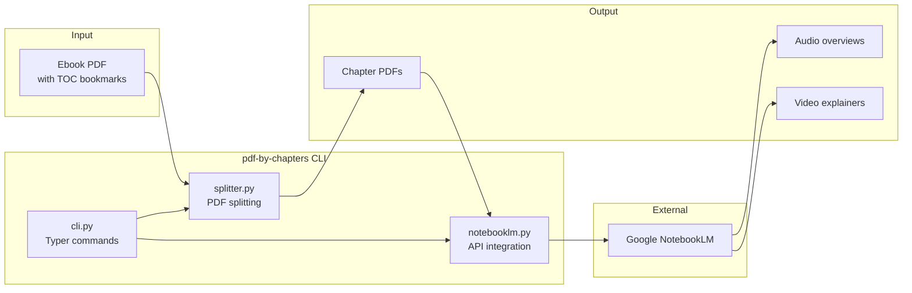
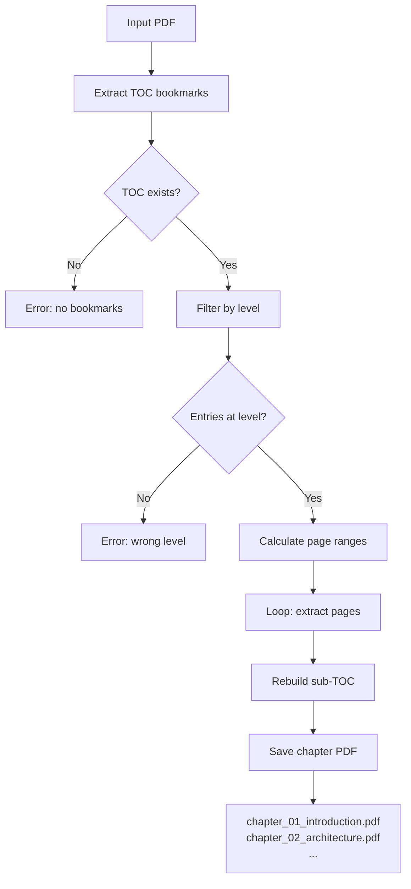
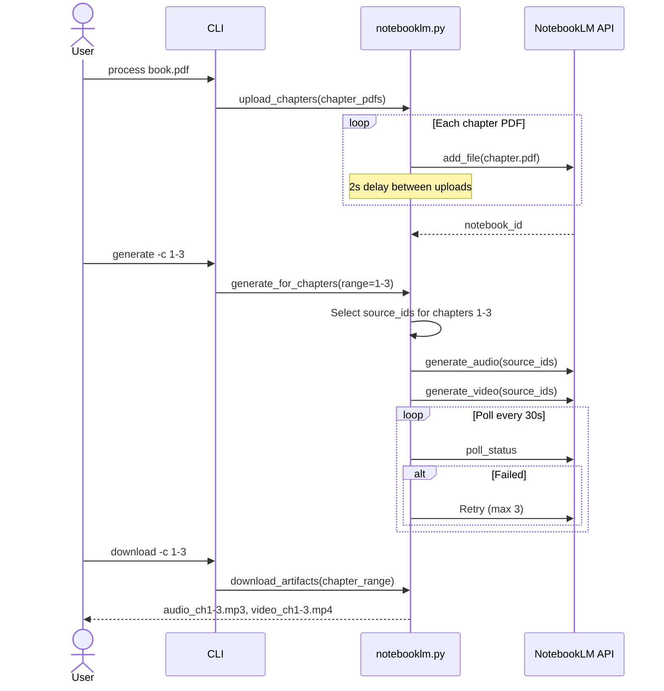
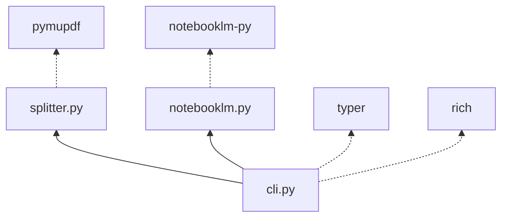

# Code Map — notebooklm-pdf-by-chapters

> Architecture, module relationships, and data flows for the `pdf-by-chapters` CLI tool.

## Overview

`notebooklm-pdf-by-chapters` splits ebook PDFs by chapter using TOC bookmarks, uploads chapters to Google NotebookLM as individual sources, and generates audio/video overviews per chapter range.

## Module Breakdown

### cli.py — Command Router

Entry point using [Typer](https://typer.tiangolo.com/). Routes to splitter and NotebookLM modules.

| Command | Description | Calls |
|---------|-------------|-------|
| `split` | Split PDF into chapter files | `splitter` |
| `process` | Split + upload to NotebookLM | `splitter` → `notebooklm` |
| `generate` | Generate audio/video for chapter range | `notebooklm` |
| `download` | Download generated artifacts | `notebooklm` |
| `list` | List notebooks or sources | `notebooklm` |
| `delete` | Delete a notebook | `notebooklm` |

### splitter.py — PDF Chapter Splitting

Uses [PyMuPDF](https://pymupdf.readthedocs.io/) to split PDFs by TOC bookmarks.

**Key features:**
- Splits on any TOC level (default: level 1 = top-level chapters)
- Preserves sub-TOC within each chapter PDF
- Sanitises filenames (lowercase, underscores, max 80 chars)
- Handles single files or directories of PDFs

### notebooklm.py — NotebookLM API Integration

Manages notebook lifecycle and chapter-aware generation.

**Chapter-aware generation:** Unlike `repo-artefacts` which generates for the whole repo, this tool selects specific NotebookLM sources by chapter range, allowing focused overviews of specific sections.

## Interfaces

| Module | Exports | Used By |
|--------|---------|---------|
| `splitter` | `split_pdf_by_chapters()`, `sanitize_filename()` | `cli.split`, `cli.process` |
| `notebooklm` | `upload_chapters()`, `generate_for_chapters()`, `download_artifacts()`, `list_notebooks()`, `list_sources()`, `delete_notebook()` | `cli.*` |

## Dependencies

