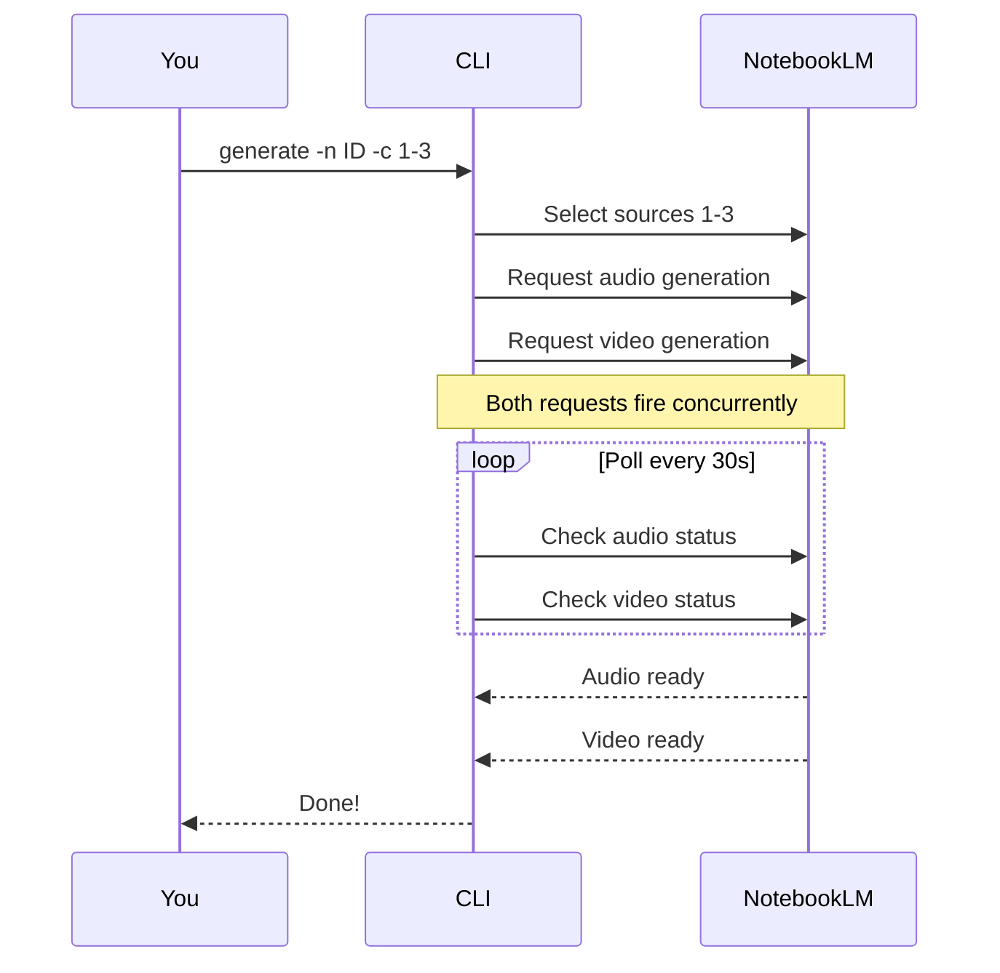
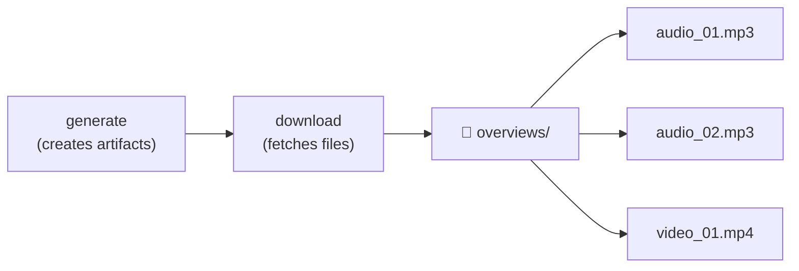

# Generating Audio & Video Overviews

Create deep-dive audio podcasts and whiteboard video explainers from your uploaded chapters.

## ✅ Prerequisites

- [ ] Chapters already uploaded to NotebookLM (see [Uploading Chapters](guide-upload-notebooklm.md))
- [ ] Your notebook ID (from the summary table or `list` command)

## Step 1: Find Your Notebook ID

```bash
pdf-by-chapters list
```

This shows all your notebooks with their IDs and source counts.

## Step 2: See Available Chapters

```bash
pdf-by-chapters list -n NOTEBOOK_ID
```

Shows numbered chapters — use these numbers for the `-c` range.

## Step 3: Generate Overviews

Audio + video for chapters 1–3:

```bash
pdf-by-chapters generate -n NOTEBOOK_ID -c 1-3
```

Audio only (faster):

```bash
pdf-by-chapters generate -n NOTEBOOK_ID -c 1-3 --no-video
```

Video only:

```bash
pdf-by-chapters generate -n NOTEBOOK_ID -c 4-6 --no-audio
```

💡 Chapter range is **1-indexed** and **inclusive** — `-c 1-3` = chapters 1, 2, and 3.

## How Generation Works



## ⏱️ How Long Does It Take?

| Type | Default timeout | Typical wait |
|------|----------------|-------------|
| Audio + Video | 900s (15 min) | 5-15 min |

Both audio and video share a single `--timeout` flag (default 900s). Override with `-t`:

💡 Start with `--no-video` if you just want audio fast.

## Step 4: Download the Results

```bash
pdf-by-chapters download -n NOTEBOOK_ID -o ./overviews
```



## 💡 Suggested Chapter Groupings

| Goal | Range size | Example |
|------|-----------|---------|
| Deep understanding | 1–2 chapters | `-c 1-2` |
| Broad overview | 3–4 chapters | `-c 1-4` |
| Quick scan | 5+ chapters | `-c 1-6` |

Smaller ranges = more detailed overviews. Start small.

## ❌ Something Went Wrong?

See [Troubleshooting](troubleshooting.md) for:

- Generation timeout → try smaller ranges or audio-only
- Auth errors → re-run `notebooklm login`
- Download fails → artifact may not be ready yet
