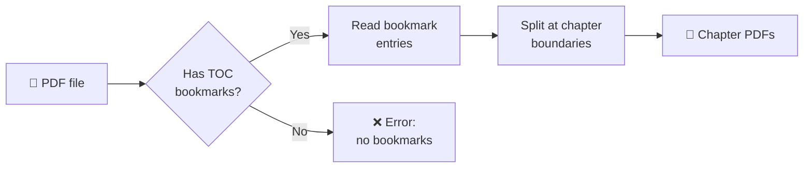
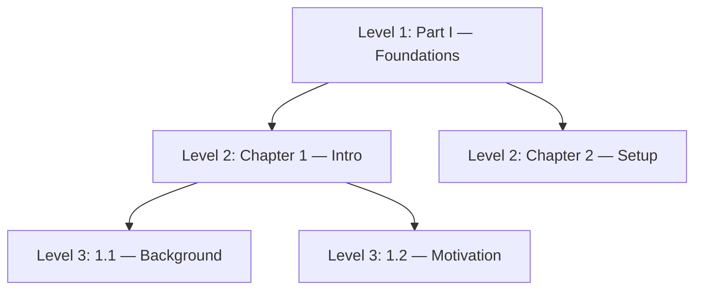

# Splitting an Ebook into Chapters

Extract individual chapter PDFs from an ebook using its built-in Table of Contents.

## ✅ Prerequisites

- [ ] Python 3.11+
- [ ] `uv` installed
- [ ] Tool installed: `uv tool install .`
- [ ] A PDF with bookmarks (most publisher ebooks have them)

## Split a Single PDF

```bash
pdf-by-chapters split "my_ebook.pdf"
```

Output goes to `./chapters/` by default. Override with `-o`:

```bash
pdf-by-chapters split "my_ebook.pdf" -o ./my-chapters
```

## Split a Directory of PDFs

```bash
pdf-by-chapters split ./ebooks/ -o ./chapters
```

Every `.pdf` in the directory gets split. Output files land in the same output folder.

## How It Works



## What the Output Looks Like

Files are named with the book, chapter number, and title:

```
chapters/
├── my_ebook_chapter_01_introduction.pdf
├── my_ebook_chapter_02_getting_started.pdf
├── my_ebook_chapter_03_core_concepts.pdf
└── my_ebook_chapter_04_advanced_topics.pdf
```

## Choosing the Right `--level`

PDF bookmarks are a tree. `--level` controls which depth you split at.



| Flag | Splits at | Use when |
|------|-----------|----------|
| `-l 1` (default) | Top-level entries (parts/chapters) | Most books |
| `-l 2` | Sub-chapters | Book has "Part" → "Chapter" structure |
| `-l 3` | Sections within chapters | You want fine-grained splits |

💡 If `-l 1` gives you too few, large files — try `-l 2`.

## ❌ Something Went Wrong?

See [Troubleshooting](troubleshooting.md) for common errors like:

- "No bookmarks/TOC" — your PDF doesn't have chapter markers
- "No TOC entries at level N" — try a different `--level`
- Empty chapters — TOC page numbers may be inaccurate
