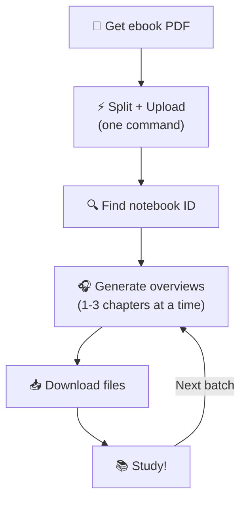
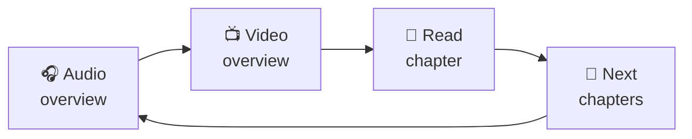

# Complete Study Workflow

The full end-to-end process: from ebook PDF to audio/video study materials.

## The Big Picture



## Step 1: Get Your Ebook PDF

You need a PDF with bookmarks (Table of Contents). Most publisher ebooks have them.

💡 Check by opening in a PDF reader — if you see a sidebar with chapter links, you're good.

## Step 2: Split and Upload

One command does both:

```bash
pdf-by-chapters process "Fundamentals of Data Engineering.pdf"
```

This splits the PDF into chapters and uploads them to NotebookLM. Copy the notebook ID from the output.

## Step 3: Generate Overviews

Start with the first few chapters:

```bash
# Find your notebook ID
pdf-by-chapters list

# Generate audio + video for chapters 1-3
pdf-by-chapters generate -n NOTEBOOK_ID -c 1-3
```

## Step 4: Download and Listen/Watch

```bash
pdf-by-chapters download -n NOTEBOOK_ID -o ./overviews
```

Files: `audio_01.mp3`, `video_01.mp4`, etc.

## Step 5: Repeat for Next Chapters

```bash
pdf-by-chapters generate -n NOTEBOOK_ID -c 4-6
pdf-by-chapters download -n NOTEBOOK_ID -o ./overviews
```

## 💡 Study Tips for AuDHD Learners

### Use Audio First

- Listen to the audio overview to get the big picture **before** reading
- Great for walks, chores, commuting — movement helps focus
- Re-listen while doing low-demand tasks for reinforcement

### Use Video for Visual Concepts

- Whiteboard videos are ideal for architecture, data flows, relationships
- Watch **after** audio — you'll already have context
- Use as a pre-read before diving into the chapter text

### Manage Overwhelm

- Process **1–2 chapters at a time** — not the whole book
- Finish one batch before generating the next
- It's okay to re-generate the same chapters if you need a refresher

### Suggested Study Cycle



1. **Audio overview** — get the shape of the content (while moving)
2. **Video overview** — see the visual structure (focused session)
3. **Read the chapter** — now you have context, reading is easier
4. **Repeat** — next 1–2 chapters

### Batch Size Guide

| Energy level | Chapters per batch | Why |
|-------------|-------------------|-----|
| Low focus day | 1 chapter | Deep, manageable |
| Normal day | 2–3 chapters | Good balance |
| Hyperfocus mode | 4–6 chapters | Ride the wave |

### Syllabus Mode (Recommended)

Instead of manually choosing batches, use `--all` to let NotebookLM group chapters by topic and generate everything automatically. This removes the decision fatigue of "which chapters should I batch together?"

**Full autopilot** — one command generates the entire podcast series:

```bash
pdf-by-chapters generate-next -n $NOTEBOOK_ID -o ./chapters --all --download --no-video
```

This creates the syllabus, generates each episode, and downloads the audio files to `./chapters/downloads/`. Episodes are generated sequentially with gaps between them and automatic retry on failure.

**Step-by-step** — for more control:

```bash
pdf-by-chapters generate-next -o ./chapters --download
```

Check progress anytime: `pdf-by-chapters status -o ./chapters --poll`

See [Generating Audio & Video Overviews](guide-generate-overviews.md) for the full syllabus workflow.
