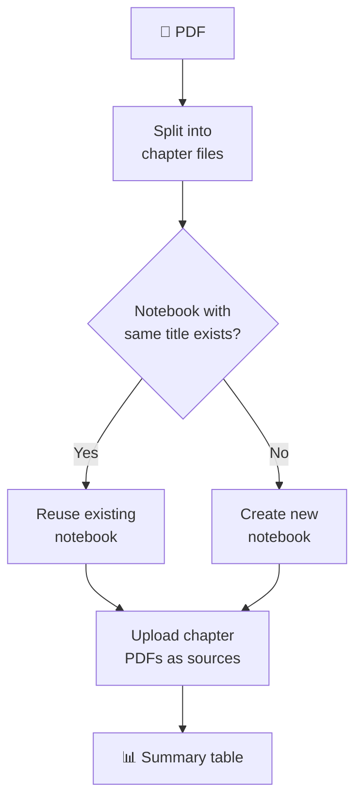

# Uploading Chapters to NotebookLM

Split a PDF into chapters and upload them to Google NotebookLM — one notebook per book, one source per chapter.

## ✅ Prerequisites

- [ ] Tool installed (see [README](../README.md#installation))
- [ ] NotebookLM authenticated: `notebooklm login`
- [ ] Internet connection

## First-Time Setup

Install the browser auth package and log in:

```bash
pip install notebooklm-py[browser]
notebooklm login
```

A browser window opens → sign in with Google → credentials saved locally.

⚠️ Auth expires periodically. Re-run `notebooklm login` if you get auth errors.

## Process a Single Book

This splits the PDF **and** uploads all chapters in one step:

```bash
pdf-by-chapters process "Fundamentals of Data Engineering.pdf"
```

## Process a Directory of Books

Each PDF gets its own subfolder and its own notebook:

```bash
pdf-by-chapters process ./ebooks/ -o ./chapters
```

## How It Works



💡 Duplicate detection is automatic — re-running `process` on the same book reuses the existing notebook instead of creating a duplicate.

## Upload to a Specific Notebook

If you already have a notebook and want to add chapters to it:

```bash
pdf-by-chapters process "my_ebook.pdf" -n NOTEBOOK_ID
```

## Understanding the Summary Table

After upload, you'll see:

```
┌──────────────────────────────────────┬──────────────────────────────────────┬──────────┐
│ Notebook Name                        │ ID                                   │ Chapters │
├──────────────────────────────────────┼──────────────────────────────────────┼──────────┤
│ Fundamentals of Data Engineering     │ ba6fa92e-f174-4a77-8fc6-fc4fc12a625d │       19 │
└──────────────────────────────────────┴──────────────────────────────────────┴──────────┘
```

- **Notebook Name** — matches your PDF filename
- **ID** — you'll need this for `generate` and `download` commands
- **Chapters** — number of chapter files uploaded

💡 Copy the ID — you'll use it in the next steps.

## ❌ Something Went Wrong?

See [Troubleshooting](troubleshooting.md) for:

- Auth errors → re-run `notebooklm login`
- Connection timeouts → check network/VPN
- Duplicate notebooks → how detection works
