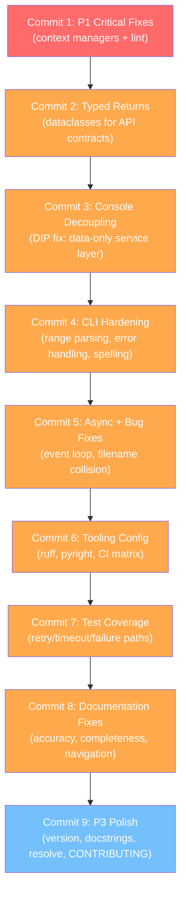
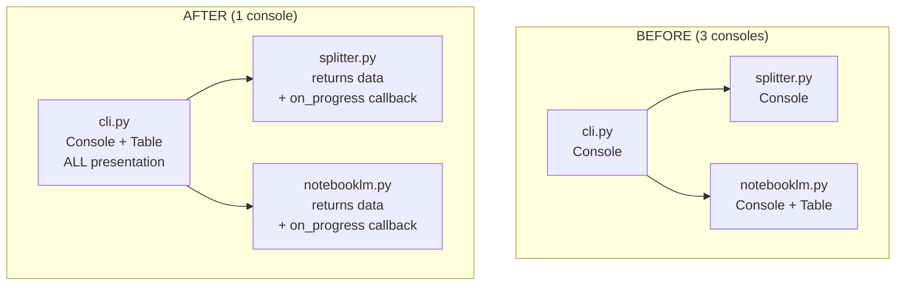

# refactor: Comprehensive Code Review Fixes

## Overview

Implement all findings from the 7-agent code review in priority order, using strategic git commits that group related changes. Each commit is a coherent, test-passing unit.

**28 findings across 3 priority levels, grouped into 9 commits.**

## Commit Strategy



---

## Commit 1: P1 Critical Fixes

**Message:** `fix: use context managers for PyMuPDF documents, fix lint errors`
**Findings:** #1, #2
**Files:** `src/pdf_by_chapters/splitter.py`, `tests/unit/test_cli.py`, `tests/unit/test_notebooklm.py`

### Tasks

- [ ] **splitter.py:43-106** — Refactor `split_pdf_by_chapters` to use `with pymupdf.open(input_path) as doc:` for the source document
- [ ] **splitter.py:80-98** — Refactor inner loop to use `with pymupdf.open() as chapter_doc:` for each chapter document
- [ ] **tests/unit/test_cli.py** — Remove unused imports: `Path` (line 3), `MagicMock` (line 4), `pytest` (line 6)
- [ ] **tests/unit/test_cli.py:91** — Fix unused variable: change `result = runner.invoke(...)` to just `runner.invoke(...)`
- [ ] **tests/unit/test_notebooklm.py** — Remove unused imports: `Path` (line 3), `pytest` (line 6)
- [ ] Run `uv run ruff check src/ tests/` — verify 0 errors
- [ ] Run `uv run pytest -v` — verify all 58 tests pass

### Implementation Detail

```python
# splitter.py — BEFORE (lines 43-106)
doc = pymupdf.open(input_path)
# ...80 lines of work...
doc.close()

# splitter.py — AFTER
with pymupdf.open(input_path) as doc:
    # ...all work inside context manager...
    for i, (title, start_page) in enumerate(chapters):
        with pymupdf.open() as chapter_doc:
            chapter_doc.insert_pdf(doc, from_page=start, to_page=end)
            # ...rebuild TOC, save...
```

---

## Commit 2: Typed Returns

**Message:** `refactor: replace dict returns with dataclasses for type safety`
**Findings:** #3
**Files:** `src/pdf_by_chapters/notebooklm.py`, `src/pdf_by_chapters/cli.py`, `tests/unit/test_notebooklm.py`

### Tasks

- [ ] **notebooklm.py** — Add dataclasses at module top:
  ```python
  from dataclasses import dataclass

  @dataclass
  class UploadResult:
      id: str
      title: str
      chapters: int

  @dataclass
  class NotebookInfo:
      id: str
      title: str
      sources_count: int

  @dataclass
  class SourceInfo:
      id: str
      title: str
  ```
- [ ] **notebooklm.py:13-51** — Change `upload_chapters` return type from `dict` to `UploadResult`
- [ ] **notebooklm.py:54-72** — Change `list_notebooks` return type from `list[dict]` to `list[NotebookInfo]`
- [ ] **notebooklm.py:75-90** — Change `list_sources` return type from `list[dict]` to `list[SourceInfo]`
- [ ] **cli.py:109-111** — Update table row construction to use dataclass attributes (`r.title`, `r.id`, `r.chapters`)
- [ ] **tests/unit/test_notebooklm.py** — Update assertions to use dataclass attribute access instead of dict key access
- [ ] Run tests — verify all pass

---

## Commit 3: Console Decoupling

**Message:** `refactor: decouple presentation from business logic (DIP fix)`
**Findings:** #5
**Files:** `src/pdf_by_chapters/splitter.py`, `src/pdf_by_chapters/notebooklm.py`, `src/pdf_by_chapters/cli.py`

### Design Decision

This is the highest-impact architectural change. The approach:

1. **splitter.py** — Remove `Console` import entirely. Add an optional `on_progress: Callable[[str], None] | None = None` callback parameter. Return data only.
2. **notebooklm.py** — Remove `Console` and `Table` imports. Remove all `console.print()` calls. Functions return data only (using the dataclasses from Commit 2). Add optional `on_progress` callback for long-running operations.
3. **cli.py** — Becomes the single owner of `Console`. All Rich table rendering and progress output moves here. Passes progress callbacks to service functions.



### Tasks

- [ ] **splitter.py** — Remove `from rich.console import Console` and `console = Console()`
- [ ] **splitter.py** — Add `on_progress: Callable[[str], None] | None = None` parameter to `split_pdf_by_chapters`
- [ ] **splitter.py** — Replace `console.print(...)` calls with `if on_progress: on_progress(msg)` using plain strings (no Rich markup)
- [ ] **notebooklm.py** — Remove `from rich.console import Console`, `from rich.table import Table`, and `console = Console()`
- [ ] **notebooklm.py** — Add `on_progress` callback to `upload_chapters`, `generate_for_chapters`, `download_artifacts`, `delete_notebook`
- [ ] **notebooklm.py** — Remove all `console.print()` and Rich `Table` construction from `list_notebooks` and `list_sources`
- [ ] **cli.py** — Add Rich table rendering for `list` command output
- [ ] **cli.py** — Add progress callback wrappers that use `console.print()` with Rich markup
- [ ] Update all tests — service function tests no longer produce console output
- [ ] Run tests — verify all pass

### Scope Control

Keep the callback simple — `Callable[[str], None]` is sufficient. Do NOT over-engineer with an abstract Observer pattern, logging framework, or event system. The callback is a thin wire from service to CLI.

---

## Commit 4: CLI Hardening

**Message:** `refactor: extract chapter range parsing, fix error handling, standardise spelling`
**Findings:** #4, #6, #12
**Files:** `src/pdf_by_chapters/cli.py`, `src/pdf_by_chapters/notebooklm.py`, `tests/`

### Tasks

- [ ] **cli.py** — Extract `_parse_chapter_range(raw: str) -> tuple[int, int]` helper with consistent validation (start >= 1, end >= start)
- [ ] **cli.py:167-178** — Replace inline parsing in `generate` with `_parse_chapter_range()`
- [ ] **cli.py:216-222** — Replace inline parsing in `download` with `_parse_chapter_range()`
- [ ] **notebooklm.py:169,187,212** — Narrow `except Exception` to specific types (`httpx.HTTPError`, `OSError`, or the notebooklm-py error types). Let `TypeError`, `AttributeError` propagate.
- [ ] **notebooklm.py:96** — Rename `_request_chapter_artefact` to `_request_chapter_artifact`
- [ ] **notebooklm.py:119** — Update error message from "artefact" to "artifact"
- [ ] **notebooklm.py:133** — Update docstring "artefacts" to "artifacts"
- [ ] **docs/** — Search and replace remaining "artefact" → "artifact" in prose (excluding the `docs/artefacts/` directory name which is fine to keep as-is for URL stability)
- [ ] Add test for `_parse_chapter_range` — valid range, invalid format, start > end, start < 1
- [ ] Run tests — verify all pass

---

## Commit 5: Async + Bug Fixes

**Message:** `fix: single event loop for process, fix download filename collision`
**Findings:** #15, #16
**Files:** `src/pdf_by_chapters/cli.py`, `src/pdf_by_chapters/notebooklm.py`

### Tasks

- [ ] **cli.py:81-102** — Extract async helper `_process_pdfs(pdfs, output_dir, level, notebook_id)` that runs the PDF loop inside a single async function. Call `asyncio.run()` once instead of per-PDF.
- [ ] **notebooklm.py:250-254** — Fix download filename collision: when `chapter_range` is set AND multiple artifacts of the same type exist, append an index (`audio_ch1-3_01.mp3`, `audio_ch1-3_02.mp3`). When only one artifact exists, keep the current clean name (`audio_ch1-3.mp3`).
- [ ] Add test for filename collision scenario (mock `list_audio` to return 2+ artifacts)
- [ ] Add test for `process` with directory containing multiple PDFs
- [ ] Run tests — verify all pass

---

## Commit 6: Tooling Configuration

**Message:** `chore: add ruff/pyright config, fix CI matrix for Python 3.11`
**Findings:** #11, #14
**Files:** `pyproject.toml`, `.github/workflows/ci.yml`

### Tasks

- [ ] **pyproject.toml** — Add `[tool.ruff]` section:
  ```toml
  [tool.ruff]
  target-version = "py311"
  line-length = 99

  [tool.ruff.lint]
  select = ["E", "F", "I", "UP", "B", "SIM"]
  ```
- [ ] **pyproject.toml** — Add `[tool.pyright]` section:
  ```toml
  [tool.pyright]
  pythonVersion = "3.11"
  typeCheckingMode = "standard"
  ```
- [ ] **.github/workflows/ci.yml:19** — Add `'3.11'` to the matrix: `python-version: ['3.11', '3.12', '3.13']`
- [ ] Run `uv run ruff check src/ tests/` — verify 0 errors with new config
- [ ] Run `uv run pyright src/` — check for type errors, fix any that surface
- [ ] Run tests — verify all pass

---

## Commit 7: Test Coverage

**Message:** `test: add coverage for retry, timeout, and failure paths`
**Findings:** #13
**Files:** `tests/unit/test_notebooklm.py`

### Tasks

- [ ] **test_notebooklm.py** — Add `TestGenerateRetryBehaviour` class:
  - [ ] `test_retries_on_failure` — Mock `poll_status` to return `is_failed=True` first, then `is_complete=True`. Verify retry fires and completes.
  - [ ] `test_max_retries_exceeded` — Mock `poll_status` to always return `is_failed=True`. Verify stops after `MAX_RETRIES`.
  - [ ] `test_timeout_behaviour` — Use `timeout=1` and mock `asyncio.sleep` to not actually sleep. Verify timeout message.
  - [ ] `test_poll_error_continues` — Mock `poll_status` to raise an exception on first call, then succeed. Verify polling continues.
  - [ ] `test_request_failure_skips_artifact` — Mock `generate_audio` to raise. Verify video still proceeds.
- [ ] **test_notebooklm.py** — Add test for unknown artifact type (`_request_chapter_artifact` with label="slides")
- [ ] Run `uv run pytest --cov --cov-branch --cov-report=term-missing` — target: notebooklm.py coverage > 95%

---

## Commit 8: Documentation Fixes

**Message:** `docs: fix accuracy issues, add delete command, fix cross-references`
**Findings:** #7, #8, #9, #10
**Files:** `README.md`, `docs/guide-generate-overviews.md`, `docs/troubleshooting.md`, `docs/use-cases.md`, `docs/guide-study-workflow.md`

### Tasks

- [ ] **README.md** — Add `delete` command to Table of Contents, Usage section, and Options Reference table:
  ```markdown
  ### `delete` — Remove a notebook

  Delete a notebook and all its contents:

  \```bash
  pdf-by-chapters delete -n NOTEBOOK_ID
  \```

  Prompts for confirmation before deleting.
  ```
- [ ] **README.md:196-204** — Add missing options to Options Reference table:
  - `--timeout, -t` for `generate` (default 900)
  - `-c, --chapters` for `download`
  - `-n, --notebook-id` for `delete`
- [ ] **README.md:260-261** — Fix timeout documentation: replace separate 600/900 claim with "Default timeout is 900 seconds (15 minutes). Override with `--timeout`."
- [ ] **docs/guide-generate-overviews.md:51-64** — Fix sequence diagram to show concurrent generation:
  ```mermaid
  sequenceDiagram
      participant You
      participant CLI
      participant NotebookLM

      You->>CLI: generate -n ID -c 1-3
      CLI->>NotebookLM: Select sources 1-3
      par Fire concurrently
          CLI->>NotebookLM: Request audio generation
          CLI->>NotebookLM: Request video generation
      end
      loop Poll every 30s
          CLI->>NotebookLM: Check status
      end
      NotebookLM-->>CLI: Audio ready
      NotebookLM-->>CLI: Video ready
      CLI-->>You: Done!
  ```
- [ ] **docs/guide-generate-overviews.md:69-73** — Fix timeout table: single row showing "Both" with 900s default
- [ ] **docs/troubleshooting.md:95** — Fix `notebooklm auth` to `notebooklm login`
- [ ] **docs/guide-study-workflow.md** — Add prerequisites section at top for consistency
- [ ] **docs/use-cases.md** — Add `-n $NOTEBOOK_ID` to UC4 download examples
- [ ] **README.md** — Add "Guides" section linking to docs/:
  ```markdown
  ## Guides

  - [Splitting an Ebook](docs/guide-split-ebook.md)
  - [Uploading to NotebookLM](docs/guide-upload-notebooklm.md)
  - [Generating Overviews](docs/guide-generate-overviews.md)
  - [Complete Study Workflow](docs/guide-study-workflow.md)
  - [Troubleshooting](docs/troubleshooting.md)
  - [Code Map](docs/codemap.md)
  ```
- [ ] Add next/prev links between the four guide docs

---

## Commit 9: P3 Polish

**Message:** `chore: add __version__, fix docstrings, path safety, CONTRIBUTING.md`
**Findings:** #17, #18, #19, #20, #23, #25, #27
**Files:** `src/pdf_by_chapters/__init__.py`, `src/pdf_by_chapters/splitter.py`, `README.md`, `CONTRIBUTING.md`

### Tasks

- [ ] **__init__.py** — Add `__version__`:
  ```python
  from importlib.metadata import version
  __version__ = version("notebooklm-pdf-by-chapters")
  ```
- [ ] **splitter.py:12-17** — Fix docstring: "Removes non-alphanumeric characters (except hyphens/underscores), replaces whitespace with underscores, lowercases, and truncates to 80 chars."
- [ ] **splitter.py** — Add `.resolve()` call on `output_dir` before use
- [ ] **notebooklm.py** — Add `.resolve()` call on `output_dir` in `download_artifacts`
- [ ] **README.md "How It Works"** — Add Mermaid workflow diagram:
  ```mermaid
  flowchart LR
      A["PDF with TOC"] --> B["Split by chapter"]
      B --> C["Upload to NotebookLM"]
      C --> D["Generate audio/video"]
      D --> E["Download artifacts"]
  ```
- [ ] **README.md** — Add security note about cookie-based auth:
  ```markdown
  ### Security Note

  NotebookLM auth uses Google session cookies stored at `~/.notebooklm/`.
  These cookies grant access to your Google account — treat them like passwords.
  Do not share, commit, or expose them in CI logs.
  ```
- [ ] **CONTRIBUTING.md** — Create with dev setup, testing, and code style:
  - Prerequisites (Python 3.11+, uv)
  - Dev install: `uv sync --all-extras --dev`
  - Run tests: `uv run pytest -v`
  - Lint: `uv run ruff check src/ tests/`
  - Type check: `uv run pyright src/`
  - Pre-commit: `pre-commit install`
- [ ] Run full test suite one final time

---

## Acceptance Criteria

### Functional

- [ ] All 58+ existing tests pass after every commit
- [ ] `uv run ruff check src/ tests/` reports 0 errors
- [ ] Coverage >= 90% overall, notebooklm.py >= 95%
- [ ] `delete` command documented in README
- [ ] Timeout docs match code behaviour (single 900s default)
- [ ] All auth command references consistent (`notebooklm login`)

### Non-Functional

- [ ] Each commit is atomic and test-passing (can be cherry-picked)
- [ ] No new dependencies added
- [ ] No breaking changes to CLI interface
- [ ] Git history is clean and readable

### Quality Gates

- [ ] `uv run pytest --cov --cov-branch` passes with >= 90% coverage
- [ ] `uv run ruff check` passes with explicit rule selection
- [ ] `uv run pyright src/` passes in standard mode
- [ ] Pre-commit hooks pass on all changed files

---

## Risk Analysis

| Risk | Mitigation |
|------|-----------|
| Console decoupling (Commit 3) breaks tests | Run tests after each sub-change within the commit. This is the largest refactor. |
| PyMuPDF context manager changes behaviour | `with pymupdf.open()` is well-documented. Integration tests verify PDF output is identical. |
| Narrowing exception types misses real API errors | Check notebooklm-py source for actual exception types. Add broad fallback with logging. |
| Typed returns break existing test assertions | Update tests in same commit. Dataclass attribute access is a straightforward search-replace. |

---

## Dependency Order

Commits MUST be applied in order:

1. **Commit 1** (P1) has no dependencies
2. **Commit 2** (typed returns) has no dependencies
3. **Commit 3** (console decoupling) depends on Commit 2 (uses dataclasses for return types)
4. **Commit 4** (CLI hardening) depends on Commit 3 (cli.py restructured)
5. **Commit 5** (async + bugs) depends on Commit 3 (cli.py restructured)
6. **Commit 6** (tooling) independent but best after code changes stabilise
7. **Commit 7** (tests) depends on Commits 3-4 (function signatures changed)
8. **Commit 8** (docs) independent, best after code changes finalised
9. **Commit 9** (polish) independent, final cleanup pass
