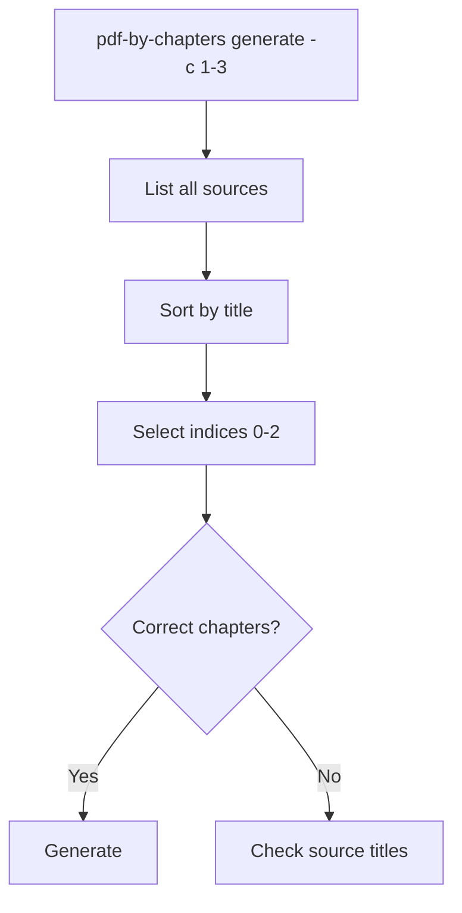
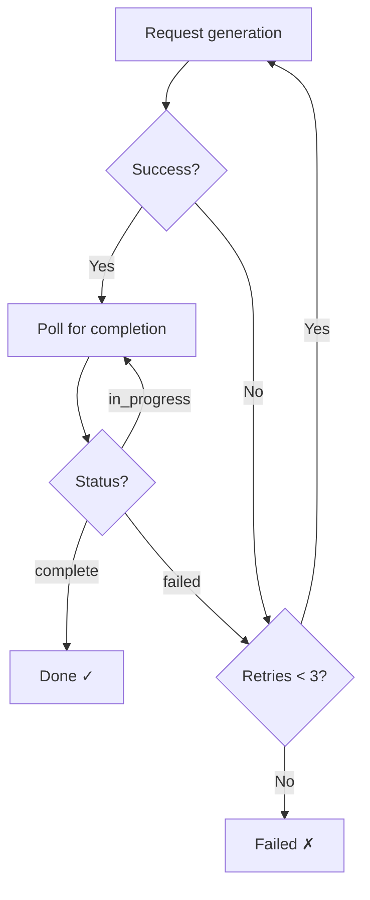

# Troubleshooting — notebooklm-pdf-by-chapters

## PDF Splitting Issues

### "No bookmarks/TOC" error

**Symptom:** `ValueError: 'book.pdf' has no bookmarks/TOC. Cannot split without chapter markers.`

**Cause:** The PDF doesn't contain TOC bookmarks (outlines). Many scanned or older PDFs lack these.

**Fixes:**
- Add bookmarks manually in a PDF editor (e.g., PDF Expert, Adobe Acrobat)
- Use `pymupdf` to add bookmarks programmatically
- Upload the full PDF to NotebookLM directly instead of splitting

### "No TOC entries at level N"

**Symptom:** `ValueError: No TOC entries at level 2. Available levels: {1}`

**Cause:** The PDF's TOC only has entries at level 1 (top-level), but you requested level 2.

**Fix:** Use `-l 1` (default) or check available levels:
```bash
python3 -c "
import pymupdf
doc = pymupdf.open('book.pdf')
levels = sorted({e[0] for e in doc.get_toc()})
print(f'Available TOC levels: {levels}')
"
```

### Chapters have wrong page ranges

**Cause:** TOC bookmarks point to incorrect pages (common in poorly-formatted PDFs).

**Workaround:** Split manually by specifying page ranges, or fix the TOC in a PDF editor.

## Generation Issues

### Generation times out

**Symptom:** "✗ Audio timed out" after 15 minutes.

**Fix:** Increase timeout:
```bash
pdf-by-chapters generate -c 1-3 --timeout 1800  # 30 minutes
```

### Wrong chapters selected

**Symptom:** Generated audio covers different chapters than expected.

**Cause:** Sources in NotebookLM are sorted alphabetically by title. If chapter filenames don't sort correctly, the range selection picks wrong sources.

**Fix:** Check source order:
```bash
pdf-by-chapters list -n $NOTEBOOK_ID
```

Verify the numbered order matches your chapter range.



### Retry behaviour

Generation retries up to 3 times per artifact:



## NotebookLM Auth Issues

### "NotebookLM authentication failed"

**Fix:**
```bash
notebooklm login
```

Opens browser for Google sign-in. Cookies stored locally.

## Syllabus Issues

### Syllabus parsing failed

**Symptom:** `Could not parse syllabus: No episodes found in LLM response`

**Cause:** NotebookLM's chat response didn't match the expected format. The tool automatically falls back to fixed-size chunks (default 2 chapters per episode).

**Fixes:**
- Re-run `syllabus --force` to try again (LLM responses vary)
- Adjust `--max-chapters` to change grouping size
- Manually edit `syllabus_state.json` to customise episode groupings

### Auto-generated artifacts from syllabus command

**Symptom:** Running `syllabus` creates unexpected audio/slide deck artifacts in NotebookLM.

**Cause:** This is a NotebookLM platform behaviour. When `chat.ask()` sends a message, Google's backend proactively auto-generates artifacts (audio overview, slide deck) as a side effect. This happens in the web UI too.

**Workaround:** These auto-generated artifacts are separate from the scoped artifacts created by `generate-next`. They can be safely ignored or deleted via `notebooklm artifact delete <id>`.

### Duplicate/identical audio content across episodes

**Symptom:** Different episodes produce identical-sounding audio.

**Cause:** NotebookLM's audio generation may not fully respect `source_ids` scoping, especially with the DEEP_DIVE format. The model may pull context from the entire notebook.

**Fixes:**
- Re-run `syllabus --force` to regenerate with updated scoped instructions
- The tool now includes chapter titles in the generation instructions to help NotebookLM focus
- Use `--episode N` to regenerate a specific episode

### State file stuck in "generating"

**Symptom:** `generate-next` keeps trying to resume a chunk that was interrupted.

**Cause:** The process was killed before completion. Task IDs are saved to the state file.

**Fixes:**
- Run `status --poll` to check if the generation actually completed on NotebookLM's side
- Use `--episode N` to reset and regenerate the stuck episode
- Manually edit `syllabus_state.json` and change the chunk status to `"pending"`

### API rejects generation requests (rate limit / quota)

**Symptom:** `audio generation rejected by API: ... (code: USER_DISPLAYABLE_ERROR)` or `RPC CREATE_ARTIFACT failed`

**Cause:** NotebookLM has daily rate limits and generation quotas. After creating many artifacts in a short period, the API starts rejecting new requests.

**Fixes:**
- Wait 30-60 minutes for rate limits to reset, then retry
- When using `--all`, the tool automatically retries with exponential backoff (60s, 180s, 300s)
- If all retries fail, the tool stops. Wait longer and run again — it resumes from the failed episode

### Full reset of syllabus state

**Symptom:** Want to start generation from scratch (e.g., after deleting artifacts manually).

**Fix:** Delete the state file and re-run:
```bash
rm ./chapters/syllabus_state.json
pdf-by-chapters generate-next -n NOTEBOOK_ID -o ./chapters --all --download --no-video
```

The `--all` flag auto-creates a fresh syllabus when the state file is missing.

### Downloads missing or skipped

**Symptom:** `Download failed for episode N: Audio artifact ... is not ready`

**Cause:** The artifact ID in the state file no longer exists in NotebookLM (e.g., manually deleted, or from a previous syllabus run).

**Fix:** The download failure is non-blocking — the pipeline continues. To re-download, regenerate the episode:
```bash
pdf-by-chapters generate-next -o ./chapters --episode N --download
```

## Common Errors

| Error | Cause | Fix |
|-------|-------|-----|
| `No PDF files found in directory` | Directory has no `.pdf` files | Check path |
| `Invalid chapter range '1-3'` | Wrong format | Use `--chapters 1-3` |
| `start must be >= 1` | Zero or negative chapter number | Chapters are 1-indexed |
| `pymupdf not found` | Missing dependency | `uv pip install pymupdf` |
| `No syllabus found` | State file missing | Run `pdf-by-chapters syllabus` first or use `--all` |
| `Syllabus already exists with in-progress chunks` | Existing state has non-pending chunks | Use `--force` to overwrite |
| `Episode N not found` | Invalid `--episode` number | Check syllabus with `status` |
| `generation rejected by API` | Rate limit or daily quota exceeded | Wait 30-60 min and retry |
| `Audio artifact ... is not ready` | Stale artifact ID from previous run | Delete state file and regenerate |
