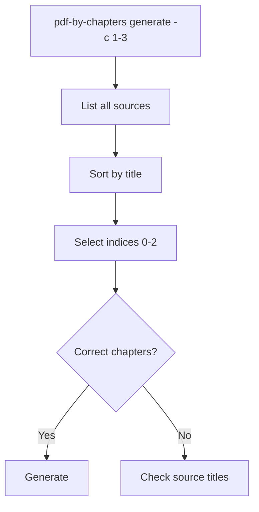
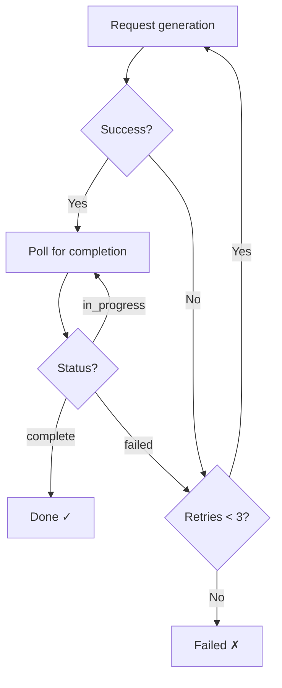

# Troubleshooting — notebooklm-pdf-by-chapters

## PDF Splitting Issues

### "No bookmarks/TOC" error

**Symptom:** `ValueError: 'book.pdf' has no bookmarks/TOC. Cannot split without chapter markers.`

**Cause:** The PDF doesn't contain TOC bookmarks (outlines). Many scanned or older PDFs lack these.

**Fixes:**
- Add bookmarks manually in a PDF editor (e.g., PDF Expert, Adobe Acrobat)
- Use `pymupdf` to add bookmarks programmatically
- Upload the full PDF to NotebookLM directly instead of splitting

### "No TOC entries at level N"

**Symptom:** `ValueError: No TOC entries at level 2. Available levels: {1}`

**Cause:** The PDF's TOC only has entries at level 1 (top-level), but you requested level 2.

**Fix:** Use `-l 1` (default) or check available levels:
```bash
python3 -c "
import pymupdf
doc = pymupdf.open('book.pdf')
levels = sorted({e[0] for e in doc.get_toc()})
print(f'Available TOC levels: {levels}')
"
```

### Chapters have wrong page ranges

**Cause:** TOC bookmarks point to incorrect pages (common in poorly-formatted PDFs).

**Workaround:** Split manually by specifying page ranges, or fix the TOC in a PDF editor.

## Generation Issues

### Generation times out

**Symptom:** "✗ Audio timed out" after 15 minutes.

**Fix:** Increase timeout:
```bash
pdf-by-chapters generate -c 1-3 --timeout 1800  # 30 minutes
```

### Wrong chapters selected

**Symptom:** Generated audio covers different chapters than expected.

**Cause:** Sources in NotebookLM are sorted alphabetically by title. If chapter filenames don't sort correctly, the range selection picks wrong sources.

**Fix:** Check source order:
```bash
pdf-by-chapters list -n $NOTEBOOK_ID
```

Verify the numbered order matches your chapter range.



### Retry behaviour

Generation retries up to 3 times per artifact:



## NotebookLM Auth Issues

### "NotebookLM authentication failed"

**Fix:**
```bash
notebooklm login
```

Opens browser for Google sign-in. Cookies stored locally.

## Common Errors

| Error | Cause | Fix |
|-------|-------|-----|
| `No PDF files found in directory` | Directory has no `.pdf` files | Check path |
| `Invalid chapter range '1-3'` | Wrong format | Use `--chapters 1-3` |
| `start must be >= 1` | Zero or negative chapter number | Chapters are 1-indexed |
| `pymupdf not found` | Missing dependency | `uv pip install pymupdf` |
