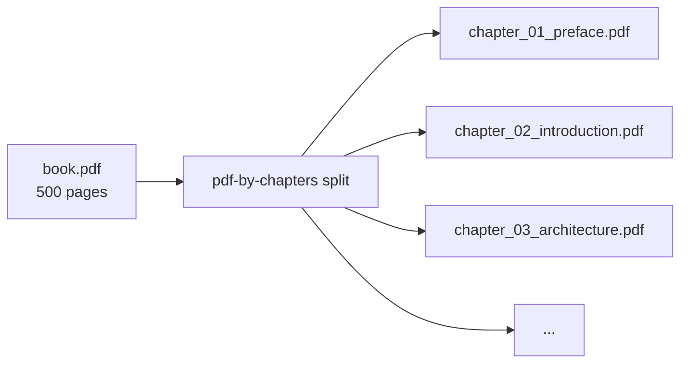
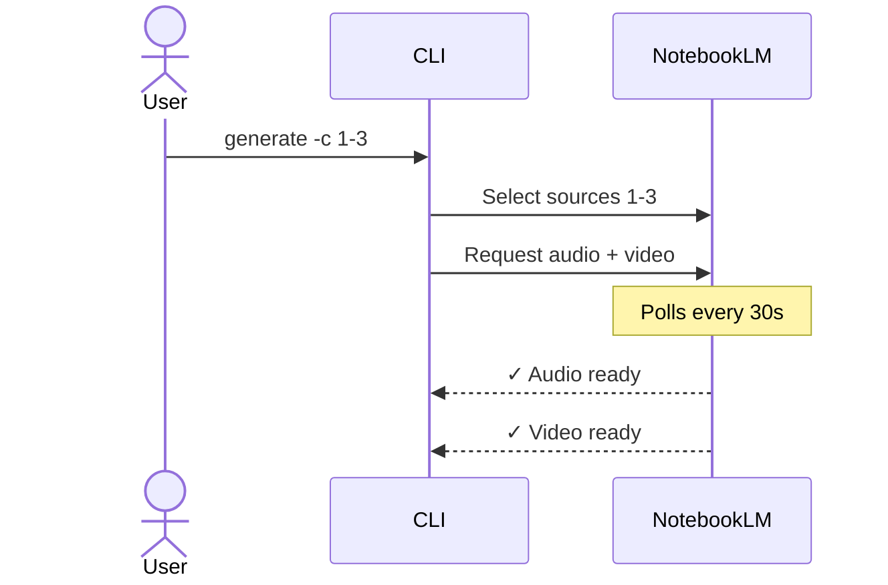
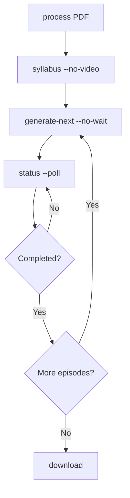

# Use Cases — notebooklm-pdf-by-chapters

## UC1: Split an ebook into chapters

> You have a PDF ebook with TOC bookmarks and want individual chapter files.

```bash
pdf-by-chapters split book.pdf -o ./chapters
```



**Options:**
- `-l 2` — Split on level 2 headings (sub-chapters)
- `-o ./output` — Custom output directory
- Pass a directory to split all PDFs in it

## UC2: Split and upload to NotebookLM

> Split chapters and upload them as individual sources in a NotebookLM notebook.

```bash
# Creates a new notebook named after the book
pdf-by-chapters process book.pdf

# Use an existing notebook
pdf-by-chapters process book.pdf -n $NOTEBOOK_ID
```

This splits the PDF, then uploads each chapter as a separate source with a 2-second delay between uploads.

## UC3: Generate audio/video for specific chapters

> You want an audio deep dive covering chapters 1-3.

```bash
export NOTEBOOK_ID=<id from process step>

# Generate both audio and video for chapters 1-3
pdf-by-chapters generate -c 1-3

# Audio only
pdf-by-chapters generate -c 1-3 --no-video

# Video only
pdf-by-chapters generate -c 1-3 --no-audio
```



## UC4: Download generated overviews

```bash
# Download with chapter range in filename
pdf-by-chapters download -c 1-3 -o ./overviews
# → overviews/audio_ch1-3.mp3, overviews/video_ch1-3.mp4

# Download all (numbered sequentially)
pdf-by-chapters download -o ./overviews
# → overviews/audio_01.mp3, overviews/video_01.mp4
```

## UC5: Full workflow — book study plan

> Process an entire textbook chapter by chapter for study.

```bash
# 1. Split and upload
pdf-by-chapters process "Fundamentals of Data Engineering.pdf"
export NOTEBOOK_ID=<returned id>

# 2. Generate overviews in batches
pdf-by-chapters generate -c 1-3    # Foundation chapters
pdf-by-chapters generate -c 4-6    # Core chapters
pdf-by-chapters generate -c 7-9    # Advanced chapters

# 3. Download all
pdf-by-chapters download -c 1-3 -o ./overviews
pdf-by-chapters download -c 4-6 -o ./overviews
pdf-by-chapters download -c 7-9 -o ./overviews
```

## UC6: Process a directory of PDFs

```bash
# Split all PDFs in a directory
pdf-by-chapters split ./ebooks/ -o ./chapters

# Process all (each gets its own notebook)
pdf-by-chapters process ./ebooks/
```

## UC7: Automated syllabus-driven generation

Generate a full podcast series from a book with AI-driven chapter grouping.

```bash
# 1. Upload chapters
pdf-by-chapters process "Data Engineering.pdf"
export NOTEBOOK_ID=<id>

# 2. Generate syllabus (audio only)
pdf-by-chapters syllabus -n $NOTEBOOK_ID -o ./chapters --no-video

# 3. Generate episodes one at a time (non-blocking)
pdf-by-chapters generate-next -o ./chapters --no-wait
pdf-by-chapters status -o ./chapters --poll  # check when ready

# 4. Repeat for each episode
pdf-by-chapters generate-next -o ./chapters --no-wait

# 5. Monitor with live display
pdf-by-chapters status -o ./chapters --tail
```



## UC8: Resume interrupted generation

If `generate-next` is interrupted (Ctrl+C, connection loss), task IDs are saved.

```bash
# Check what's in progress
pdf-by-chapters status -o ./chapters --poll

# The generating chunk will either complete or be retried automatically
pdf-by-chapters generate-next -o ./chapters
```
